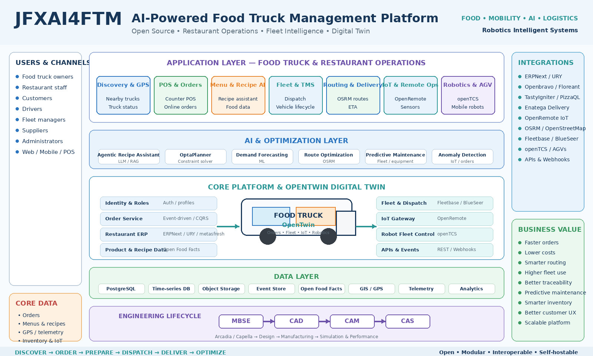

<p align="center">
  
</p>

<p align="center">
  <em>
    Open-source architecture for AI-powered food truck operations, restaurant management,
    POS, online ordering, fleet logistics, delivery, IoT, robotics, digital twins
    and MBSE-driven engineering.
  </em>
</p>

## OpenTwin AI Food Truck & Mobile Food-Service Management Platform

> Open, modular reference architecture for AI-assisted food-truck
> operations, restaurant management, fleet logistics, POS, ordering,
> delivery, IoT, routing, AGV automation, simulation, and digital twins.

## Description and Context

**jfxai4ftm / OpenTwin AI FTM** consolidates the project's open-source
technology compendium into a modular architecture for mobile
food-service businesses.

The source project explores Modelica-based AGV digital twins, GPS
tracking, Event Sourcing/CQRS, open food-product data, ERP/fleet
management, restaurant POS, AI recipe assistance, food-truck discovery
and ordering, delivery management, IoT, OpenStreetMap routing,
transportation management, AGV/mobile-robot control, logistics,
constraint optimization, and MBSE with Arcadia/Capella.

The consolidation treats these projects as **required dependencies,
optional integrations, or research references** rather than assuming
they form one mandatory runtime.

## Vision

``` text
CUSTOMER CHANNELS
Web / Mobile / QR / Marketplace
        |
ORDERING & COMMERCE
POS / Menu / Payment Adapter / CRM
        |
OPENTWIN FTM CORE
        |
Truck Twin / Kitchen Twin / Order Twin / Fleet Twin / Inventory Twin
        |
AI & OPTIMIZATION
Recipes / Demand / Routing / Scheduling / Inventory
        |
LOGISTICS & OPERATIONS
GPS / IoT / Delivery / TMS / AGV / Mobile Robots
        |
DATA & EVENTS
```

**Design principle:** an open, modular architecture designed to minimize
proprietary lock-in and enable independent implementations.

## Objectives

-   Modular food-truck and mobile restaurant management.
-   POS, menu, ordering, kitchen and delivery integration.
-   Digital twins for trucks, kitchens, equipment, inventory and fleet
    assets.
-   GPS and open geospatial routing.
-   AI-assisted demand, recipes, scheduling, inventory and optimization.
-   IoT/edge operation for mobile assets.
-   ERP, TMS and fleet interoperability.
-   AGV/mobile-robot integration.
-   Event-driven APIs and traceability.
-   Modelica simulation and MBSE.
-   Replaceable implementations and documented interfaces.

## Reference Architecture

``` text
┌───────────────────────────────────────────────────┐
│ EXPERIENCE: Customer | POS | Operator | Driver   │
└──────────────────────┬────────────────────────────┘
                       |
┌──────────────────────▼────────────────────────────┐
│ BUSINESS: Menu | Orders | Kitchen | Inventory   │
│ CRM | Finance | Delivery                        │
└──────────────────────┬────────────────────────────┘
                       |
┌──────────────────────▼────────────────────────────┐
│ OPENTWIN CORE: Twin Registry | State | Events   │
│ Relationships | Provenance | Rules | Workflows  │
└──────────────────────┬────────────────────────────┘
                       |
┌──────────────────────▼────────────────────────────┐
│ AI: Demand | Recipes | Routing | Scheduling     │
└──────────────────────┬────────────────────────────┘
                       |
┌──────────────────────▼────────────────────────────┐
│ EDGE/LOGISTICS: GPS | IoT | TMS | AGV | Fleet  │
└──────────────────────┬────────────────────────────┘
                       |
┌──────────────────────▼────────────────────────────┐
│ DATA: SQL | Events | Objects | Vector | GIS     │
└───────────────────────────────────────────────────┘
```

Cross-cutting: **Security · Privacy · Food Safety · Audit ·
Observability · Licensing · Resilience**.

## Core Domains

``` text
Organization
└─ Food-Service Business
   ├─ Food Trucks
   ├─ Kitchens
   ├─ Warehouses
   ├─ Menus
   ├─ Customers
   ├─ Orders
   ├─ Inventory
   ├─ Suppliers
   ├─ Delivery Fleet
   └─ Robotics / Automation
```

## OpenTwin Digital Twins

Twin types can include:

-   Food Truck Twin
-   Kitchen Twin
-   Refrigeration Twin
-   Cooking Equipment Twin
-   Energy Twin
-   Inventory Twin
-   Delivery Vehicle Twin
-   Warehouse Twin
-   AGV Twin
-   Route/Mission Twin

``` text
Physical Asset → Sensors/POS/GPS → Twin Adapter
               → Digital Twin State
               → AI / Rules / Simulation
               → Decision Support
               → Human Approval / Bounded Automation
```

Example:

``` yaml
twin:
  id: truck-001
  type: food-truck
  state:
    operating_status: active
    location: {}
    energy: {}
    refrigeration: {}
    inventory: {}
  telemetry_refs: []
  model_refs: []
  relationships: []
  provenance: {}
```

## AI and Decision Intelligence

Candidate capabilities:

-   demand forecasting;
-   menu and recipe assistance;
-   ingredient substitution;
-   inventory forecasting;
-   waste reduction;
-   route optimization;
-   location recommendation;
-   preparation-time prediction;
-   delivery ETA;
-   predictive maintenance;
-   anomaly detection;
-   natural-language operational assistance.

AI outputs should preserve relevant model/version provenance and remain
subordinate to required operational and food-safety controls.

## Ordering, POS and Restaurant Operations

``` text
Customer → Ordering Channel → Order Service
         → POS Adapter → Kitchen Workflow
         → Inventory → Pickup / Delivery
```

Capabilities can include digital menus, online ordering, POS, kitchen
tickets, promotions, inventory consumption, receipts, reporting, and
CRM. Payment processing should remain behind compliant payment-provider
adapters.

## Fleet Logistics and Routing

``` text
Orders → Dispatch → Route Optimizer
       → OSM-compatible Routing
       → Vehicle / Driver
       → GPS Telemetry → Fleet Twin
```

Functions include vehicle registry, live location, routes, stops,
deliveries, dispatch, ETA, maintenance, geofencing and logistics
analytics.

## IoT and Edge

``` text
Truck Sensors → Edge Gateway → Local Buffer/Rules
              → MQTT/HTTP/Events → OpenTwin Platform
```

Telemetry can include GPS, refrigeration, energy, water tanks, equipment
state, environment and vehicle diagnostics. Local operation should
preserve essential workflows during intermittent connectivity.

## AGV and Mobile Robotics

``` text
ERP/WMS/FTM → Work Order → Robot Mission API
            → Fleet Controller → AGV/Mobile Robot
            → Telemetry/Result → Digital Twin
```

Use cases include commissary logistics, ingredient movement,
replenishment, staging and warehouse transport. Safety-critical motion
control must be isolated from untrusted AI services.

## Food Product and Recipe Intelligence

Open food-product data, recipe knowledge, inventory and business
constraints can feed an AI-assisted menu workflow.

``` text
Food Data + Recipe Knowledge + Inventory
              ↓
       Recipe Assistant
              ↓
        Menu Candidate
              ↓
         Human Review
```

Allergen and food-safety information must be verified against
authoritative operational sources before use.

## Data and Event Architecture

``` text
Apps / POS / IoT / Fleet / ERP
              |
          API Gateway
              |
        Domain Services
              |
       Events / CQRS
              |
 SQL / Event Store / Objects / GIS
              |
      Analytics / AI / RAG
```

Example events:

``` text
truck.location.updated
order.created
order.ready
delivery.dispatched
delivery.completed
inventory.changed
temperature.alert.created
agv.mission.completed
maintenance.required
```

Event Sourcing/CQRS should be used only where its additional complexity
is justified.

## Open Modular APIs

``` text
Organization API
Truck API
Twin API
Menu API
Recipe API
Order API
POS API
Kitchen API
Inventory API
Fleet API
Route API
Delivery API
Telemetry API
Warehouse API
Robot API
Simulation API
AI API
Analytics API
```

Example resources:

``` text
/api/v1/trucks
/api/v1/twins
/api/v1/menus
/api/v1/orders
/api/v1/inventory
/api/v1/fleet
/api/v1/routes
/api/v1/deliveries
/api/v1/telemetry
/api/v1/robots
```

OpenAPI and AsyncAPI can define synchronous and event-driven contracts.

## Security, Privacy and Food-Safety Traceability

Recommended controls:

-   OIDC/OAuth2-compatible identity;
-   RBAC/ABAC;
-   encrypted communications;
-   device identity;
-   secrets management;
-   audit logging;
-   API rate limiting;
-   network segmentation;
-   backups;
-   signed artifacts;
-   dependency scanning;
-   payment-provider isolation;
-   privacy-aware location retention;
-   role-scoped customer data;
-   food-safety event traceability.

``` text
Ingredient Lot → Storage Condition → Preparation
               → Order → Customer-facing Product
```

## MBSE and Simulation

The engineering structure can preserve **MBSE → CAD → CAM → CAS**, with
Arcadia/Capella for systems architecture.

``` text
Stakeholder Needs → Operational Analysis
                  → System Analysis
                  → Logical Architecture
                  → Physical Architecture
                  → Implementation
                  → Simulation / Validation
```

Modelica can support multidomain models for vehicle energy,
refrigeration, thermal behavior, batteries, HVAC, AGV dynamics and
mobile-kitchen electrical loads. Simulation engines should be accessed
through replaceable adapters.

## Open-Source Technology Compendium

  -----------------------------------------------------------------------
  Domain                  Candidate / Reference   Potential Role
  ----------------------- ----------------------- -----------------------
  Digital Twin / AGV      AGVSystem               Modelica AGV
                                                  digital-twin reference

  GPS                     Traccar                 Vehicle tracking

  Architecture            digital-restaurant      Event Sourcing/CQRS
                                                  reference

  Food Data               Open Food Facts         Collaborative
                                                  food-product data

  Fleet ERP               VSD Fleet Management /  Fleet management
                          ERPNext                 

  Fleet                   Fleet Management        Architecture showcase
                          Blueprint               

  Restaurant ERP/POS      POS Restaurant /        Restaurant operations
                          ERPNext                 

  AI                      Agentic Recipe          Recipe assistance
                          Assistant               

  Food Trucks             Food_Truck              Discovery, menu and
                                                  ordering

  Restaurant ERP          URY                     Restaurant ERP
                                                  reference

  ERP                     metasfresh              Open ERP reference

  POS                     Openbravo Java POS      POS reference

  POS                     Floreant POS            Restaurant/QSR POS

  Restaurant Platform     TastyIgniter            Ordering and management

  Orders                  PizzaQL                 OSS order-management
                                                  reference

  Delivery                Enatega                 Delivery-management
                                                  reference

  IoT                     OpenRemote              IoT platform

  Routing                 OSRM                    OpenStreetMap routing

  TMS                     BlueSeer TMS            Transportation
                                                  management

  AGV Control             openTCS                 AGV/mobile-robot
                                                  control

  Logistics               Fleetbase               Modular logistics
                                                  platform

  Optimization            OptaPlanner             Constraint-solving
                                                  reference

  MBSE                    Capella / Arcadia       Systems architecture

  Simulation              Modelica                Multidomain simulation

  APIs                    OpenAPI / AsyncAPI      Interface contracts

  Database                PostgreSQL              Relational persistence

  Containers              Docker                  Reproducible deployment

  Orchestration           Kubernetes              Scalable deployment
  -----------------------------------------------------------------------

Inclusion does not imply that a component is bundled, mandatory,
endorsed, currently compatible, or suitable for every deployment. Verify
current license, maintenance, security and integration requirements.

## User Guide

1.  Create a food-service organization.
2.  Register trucks, kitchens, warehouses and vehicles.
3.  Configure menus and products.
4.  Connect ordering/POS channels.
5.  Register digital twins.
6.  Connect GPS and approved IoT telemetry.
7.  Configure inventory.
8.  Receive and prepare orders.
9.  Dispatch pickup or delivery.
10. Monitor mobile assets.
11. Record inventory and operational outcomes.
12. Analyze sales, demand, routes and equipment.
13. Run optional AI recommendations or simulations.

## Installation Guide

``` bash
git clone https://github.com/robotics-intelligent-systems/jfxai4ftm.git
cd jfxai4ftm
```

The repository currently functions primarily as a technology
compendium/reference architecture. It should not imply that every
referenced project must be installed.

Minimal target deployment:

``` text
Web/POS Client
     |
FTM Core API
     |
PostgreSQL
     |
Order + Inventory
     |
Truck/Twin Service
```

Extended deployment can add an event broker, object storage, GPS
adapter, routing adapter, IoT platform, ERP/POS integration, AI service,
Modelica adapter, logistics adapter and AGV controller.

Executable modules should specify tested OS/runtime versions, SDKs,
package managers, environment variables, migrations, tests, networking,
storage and security configuration.

## Dependencies

### Required

Only components strictly necessary for an executable module.

### Optional Integrations

Examples: Traccar, OpenRemote, OSRM, ERPNext, Fleetbase, openTCS,
restaurant POS systems, Open Food Facts, Modelica, Capella, PostgreSQL
and Kubernetes.

### Research References

Projects retained for architectural comparison, experimentation or
inspiration without becoming runtime dependencies.

Recommended record:

``` yaml
dependency:
  name:
  version:
  role:
  status: required | optional | reference
  license:
  source:
  tested_platforms:
  security_notes:
```

## Recommended Repository Structure

``` text
jfxai4ftm/
├── README.md
├── LICENSE
├── CONTRIBUTING.md
├── CODE_OF_CONDUCT.md
├── docs/
├── mbse/
├── core/
│   ├── organizations/
│   ├── trucks/
│   ├── menus/
│   ├── orders/
│   └── inventory/
├── twins/
│   ├── registry/
│   ├── state/
│   └── adapters/
├── pos/
├── kitchen/
├── fleet/
├── routing/
├── delivery/
├── iot/
├── robotics/
├── ai/
│   ├── recipes/
│   ├── forecasting/
│   └── optimization/
├── simulation/modelica/
├── integrations/
│   ├── erp/
│   ├── pos/
│   ├── gps/
│   ├── routing/
│   └── logistics/
├── api/
├── events/
├── analytics/
├── deployment/
├── tests/
└── examples/
```

## Business Models and Use Cases

-   **Independent Food Truck:** POS, inventory, location and analytics.
-   **Food-Truck Fleet:** centralized dispatch, maintenance and demand
    planning.
-   **Mobile Kitchen Network:** shared commissary and warehouse
    integration.
-   **Event Food Service:** temporary/geofenced mobile operations.
-   **Delivery-First Restaurant:** online ordering, dispatch and
    last-mile delivery.
-   **Smart Commissary:** ERP/WMS plus optional mobile robotics.
-   **Research/Education:** Modelica, digital twins, MBSE and logistics
    optimization.

## MVP

``` text
Customer Web App
      |
   Order API
      |
Menu / Inventory / Truck
      |
  PostgreSQL
      |
Truck GPS / Twin
      |
Operator Dashboard
```

MVP features:

-   organization and food-truck registry;
-   menus/products;
-   orders;
-   basic POS workflow;
-   inventory;
-   truck location;
-   digital-twin state;
-   dashboard;
-   basic route support;
-   REST API;
-   audit/provenance metadata;
-   Docker-based local deployment.

Success criteria:

-   customer can view menu and create order;
-   operator can accept/complete order;
-   inventory changes are recorded;
-   truck position updates its twin;
-   truck/order status is visible;
-   deployment is reproducible;
-   no proprietary cloud is required.

## Development Roadmap

### Phase 1 --- Architecture and Documentation

-   [x] BID-inspired documentation structure.
-   [x] Technology-compendium consolidation.
-   [x] OpenTwin architecture.
-   [x] Modular API model.
-   [ ] Architecture Decision Records.
-   [ ] Formal schemas.

### Phase 2 --- Food-Service Core

-   [ ] Organizations and trucks.
-   [ ] Menus/products.
-   [ ] Orders and inventory.
-   [ ] POS workflow.

### Phase 3 --- Fleet and Digital Twins

-   [ ] GPS integration.
-   [ ] Twin registry/state/history.
-   [ ] Fleet dashboard.
-   [ ] Maintenance records.

### Phase 4 --- Logistics

-   [ ] Routing adapter.
-   [ ] Dispatch and delivery.
-   [ ] Driver/vehicle assignments.
-   [ ] ETA calculation.

### Phase 5 --- AI and Optimization

-   [ ] Demand forecasting.
-   [ ] Recipe assistant.
-   [ ] Inventory optimization.
-   [ ] Route/location optimization.

### Phase 6 --- IoT and Simulation

-   [ ] Temperature and energy telemetry.
-   [ ] Alert rules.
-   [ ] Modelica adapter.
-   [ ] What-if scenarios.

### Phase 7 --- ERP and Robotics

-   [ ] ERP/POS adapters.
-   [ ] Warehouse integration.
-   [ ] AGV controller adapter.
-   [ ] Robot mission API.
-   [ ] Human/safety controls.

### Phase 8 --- Scaling

-   [ ] Multi-fleet tenancy.
-   [ ] Event-driven services.
-   [ ] Kubernetes deployment.
-   [ ] Advanced analytics.
-   [ ] Observability/resilience.

## How to Contribute

Contributions are welcome in restaurant systems, food-truck management,
POS, ERP, fleet/logistics, routing, IoT, digital twins, AI,
optimization, Modelica, MBSE, robotics, security, analytics and
documentation.

``` bash
git checkout -b feature/my-contribution
git add .
git commit -m "Add: description of contribution"
git push origin feature/my-contribution
```

Pull requests should document the problem, solution, architecture
impact, interfaces, dependencies, licensing, security/privacy
implications, operational-safety impact, tests and documentation.

Do not commit secrets, payment credentials, private customer data,
proprietary datasets or unauthorized third-party content.

## Code of Conduct

Contributors should maintain a respectful, inclusive, professional and
technically constructive environment. A dedicated `CODE_OF_CONDUCT.md`
should be maintained at repository root.

## Authors and Maintainers

Maintained by the **Robotics Intelligent Systems** open-source
initiative.

Repository: `robotics-intelligent-systems/jfxai4ftm`

Third-party software, trademarks, datasets, standards and reference
projects remain the property of their respective owners.

## Intellectual Property and Open Design

OpenTwin FTM favors open standards, modular adapters, replaceable
implementations, original reference architectures, explicit provenance
and appropriately licensed dependencies/assets.

The architecture is designed to **minimize proprietary lock-in and
enable independent implementations**.

This does not guarantee that an implementation is free from every
third-party patent, trademark or other intellectual-property right in
every jurisdiction. Open-source licensing and patent freedom are not
synonymous. Implementers remain responsible for appropriate
intellectual-property review.

## Disclaimer

jfxai4ftm / OpenTwin AI Food Truck Management Platform is a **research,
educational, engineering and experimental project**.

AI recommendations, route optimization, simulations and digital-twin
outputs may be incomplete or inaccurate and should be validated before
consequential operational use.

Deployments involving food preparation, allergens, payments, vehicles,
refrigeration, electrical equipment, autonomous equipment or robots must
comply with applicable safety, food-service, privacy, transportation and
other requirements.

The BID repository template is used solely as a
**documentation-structure reference**. jfxai4ftm does not claim BID/IDB
funding, sponsorship, endorsement, catalog membership or institutional
affiliation.

## License

The actual jfxai4ftm license should remain in the repository root as
`LICENSE`, `LICENSE.md`, or its existing equivalent.

Third-party libraries, frameworks, datasets, models, maps and
documentation retain their respective licenses and terms.

Do not automatically apply a BID/IDB software license, institutional
copyright, funding statement or disclaimer merely because its
documentation template informed this README.

------------------------------------------------------------------------

## OpenTwin FTM Principles

**Open Architecture · Modular Digital Twins · AI-Assisted Operations ·
Interoperability · Event-Driven Integration · Human Oversight ·
Reproducibility**

> Connect the customer to the kitchen.\
> Connect the kitchen to the truck.\
> Connect the truck to its digital twin.\
> Connect logistics to open routing and telemetry.\
> Use AI as decision support.\
> Keep every integration replaceable.
